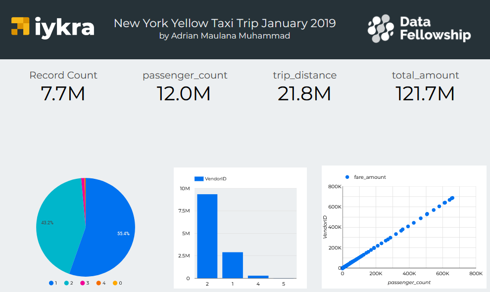
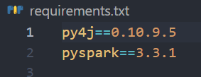

# IYKRA DF 8 Assignment 5 - Adrian Maulana Muhammad
## Assignment Objective
Divided into two parts: 
- Part 1 :  Create a dashboard with your own choice of tool with the yellow taxi trip records 2019 (dataset pressumably is already there, or if not,  available to be downloaded here: https://www.kaggle.com/datasets/microize/newyork-yellow-taxi-trip-data-2020-2019?resource=download or https://www1.nyc.gov/site/tlc/about/tlc-trip-record-data.page). Put the dashboard url and the screenshot of the dashboard in the repo, with a little explanation about the dashboard you made.
- Part 2 : Create a guide to install pyspark and put it in your repo. Print its version, screenshot it, and put the screenshot in the repo.
## Part 1: Dashboard New York Taxi Trips in January 2019
### Dashboard Description
My dashboard shows the total record count, passenger count, trip distance, total amount on January 2019 using scorecard. And shows the composition of the payment type using pie chart, shows the composition of Vendor ID using bar chart, and correlation between fare amount and passenger count using scatter chart.
### Dashboard URL
[Dashboard Assignment 5 URL](https://datastudio.google.com/reporting/3d269a08-bbab-4b7a-8223-f739ac0d30e9)
### Dashboard Screenshot

## Part 2: Installing PySpark
- I install PySpark using PIP. the command looks like this: `pip install pyspark`
- The PySpark Version I have installed is as follow:

